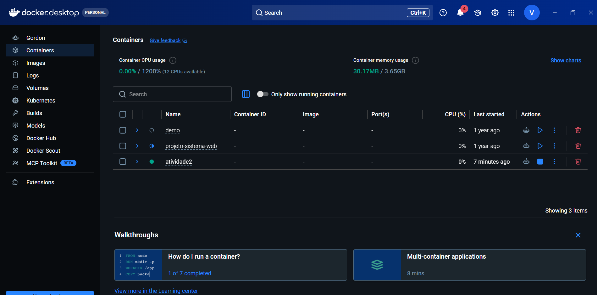
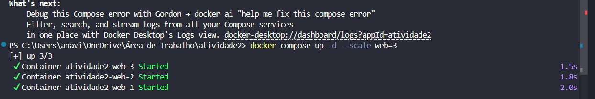
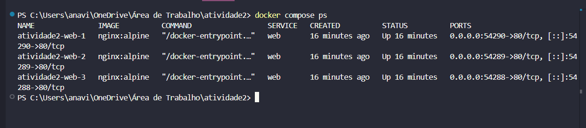
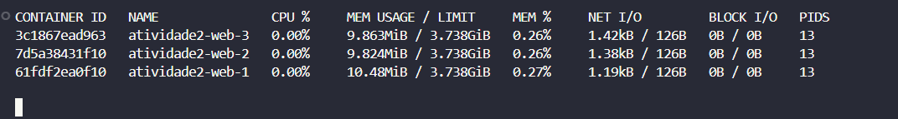
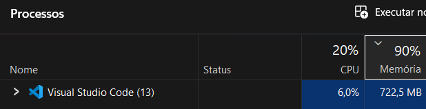
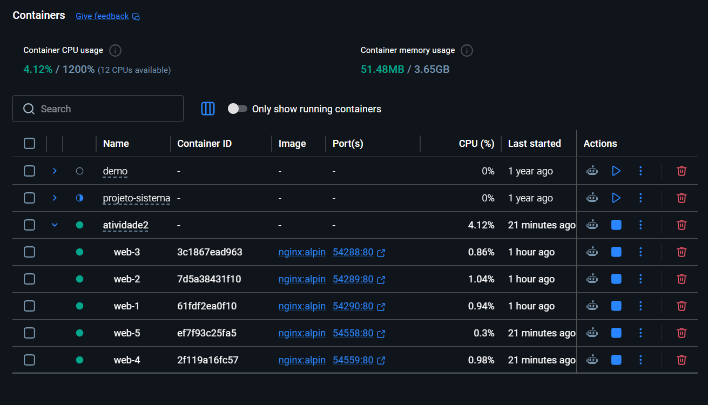

# Computação na Nuvem

**Professor:** Rodrigo Viana  
**Semestre:** 2026.1

---

## Identificação

**Exercício: Simulando Escalabilidade com Docker** <!-- ex: Exercício 2 - Simulando Escalabilidade com Docker -->

**Integrantes da equipe:**

| Nome completo | Matrícula |
|---|---|
|Ana Vitória Lima da Silva |25000013 |
|Ryan Xavier Feitosa | 25000024 |
|| ||

---

## Desenvolvimento

<!-- Descreva aqui o que foi feito, passo a passo. Use sub-seções se necessário. -->
1 - Baixamos o Docker e criamos uma conta usando o Gmail. Depois, criamos o arquivo no Visual Studio Code e copiamos o código disponibilizado no Git. 

2 - Em seguida, subimos 3 réplicas dos contêineres, anotamos as portas e executamos comandos para observar o uso da CPU, alternando entre as portas. 

3 - Depois, adicionamos mais réplicas para analisar o desempenho e, por fim, removemos todas enquanto o sistema ainda estava em execução, deixando apenas uma réplica ativa.

---

## Evidências

<!-- Insira os prints/capturas de tela solicitados. -->
<!-- Para imagens hospedadas (ex: GitHub Issues, Imgur): -->
<!--  -->

### Passo 1 — INSTALAÇÃO DOCKER

### Passo 2 — CRIAR E TESTAR ARQUIVO

### Passo 3 — Confirmar os contêineres e suas portas

### Passo 4 — Observar o uso de recursos em reserva

### Passo 5 — Gerar carga e observe a mudança

### Passo 6 — Aumentar as réplicas e distribuir a carga:

---

## Respostas

<!-- Responda as perguntas do exercício abaixo. -->

**1. Qual a diferença entre escalabilidade vertical e horizontal?**  
Vertical - Melhorar a mesma máquina, deixando ela mais potente

Horizontal - Adicionar mais máquinas/containers trabalhando juntos para dividir o serviço.

**2. O que você acabou de fazer foi escalabilidade vertical ou horizontal? Por quê?**  
Horizontal, porque o serviço é dividido para mas de uma réplicas.

**3. O que aconteceria se um dos containers falhasse com 3 réplicas? E com apenas 1?**  
Com tres réplicas, se um dos containes falhasse, uma substituiria o serviço, mas com apenas uma, o sistema sairia do ar. 

---

## Conclusão

Concluímos que ambas as escalabilidades ajudam a manter o serviço/sistema ativo caso alguma máquina falhe.

<!-- Com as palavras de vocês, o que voc~es concluíram nesse exercício? -->