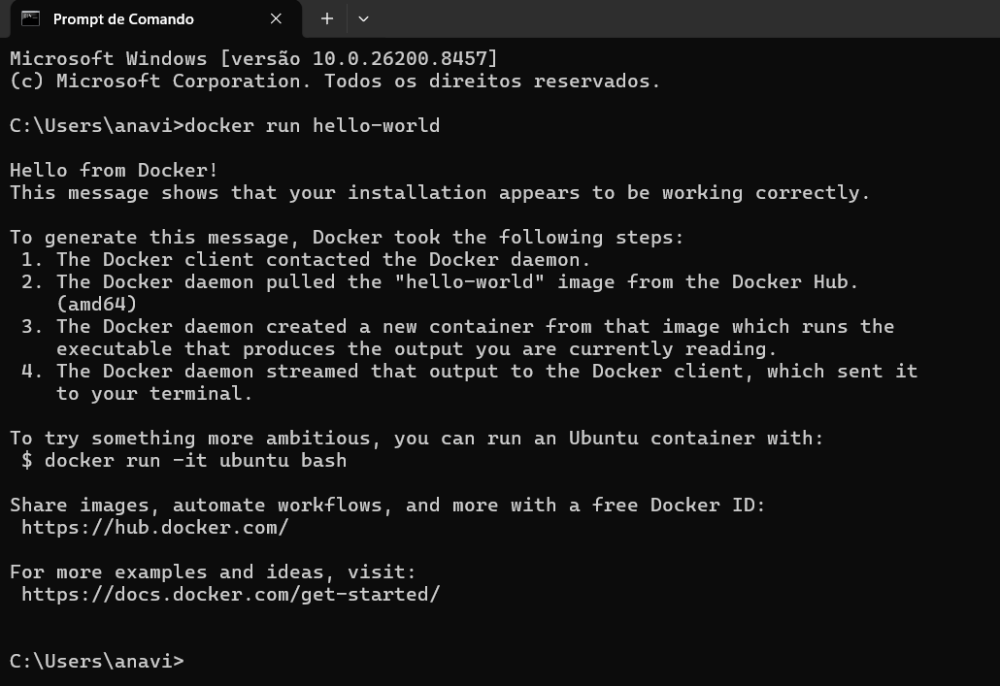
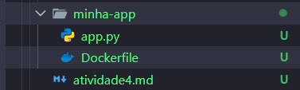
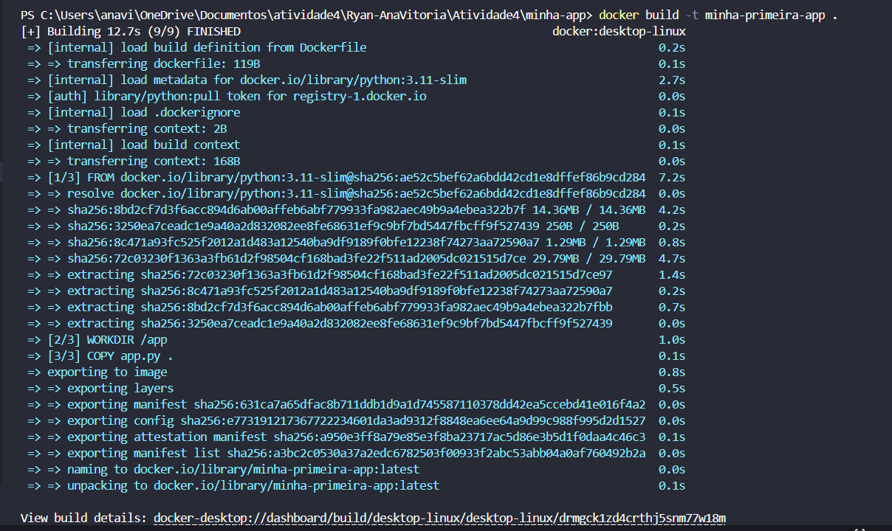
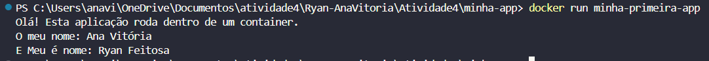

<div align="center">


# Computação na Nuvem

**Professor:** Rodrigo Viana  
**Semestre:** 2026.1

</div>

---

## Identificação

**Primeiro Container com Docker** <!-- ex: Exercício 2 - Simulando Escalabilidade com Docker -->

**Integrantes da equipe:**

| Nome completo | Matrícula |
|---|---|
|Ana Vitória Lima da Silva |25000013 |
|Ryan Xavier Feitosa | 25000024 |
|| ||

---

## Desenvolvimento

<!-- Descreva aqui o que foi feito, passo a passo. Use sub-seções se necessário. -->

1 - Nesta atividade agente fez a instalação e verificação do Docker utilizando o comando `docker run hello-world`.
Em seguida, foi criada uma aplicação simples em Python com um arquivo `app.py` e um `Dockerfile`.

2 - Depois, a imagem foi criada com o comando `docker build` e executada com `docker run`, permitindo visualizar a aplicação funcionando em um container. 

3 - Por fim, a imagem foi publicada no Docker Hub, possibilitando seu compartilhamento. Com isso, foi possível praticar os processos de criação, execução e distribuição de containers.


---

## Evidências

<!-- Insira os prints/capturas de tela solicitados. -->
<!-- Para imagens hospedadas (ex: GitHub Issues, Imgur): -->
<!--  -->


## Arquivos Utilizados

<a href="imagem/">Prints</a>


### Passo 1 — Testar o Docker:



### Passo 2 — Organizando os arquivos:



### Passo 3 — Construindo a imagem:



### Passo 4 — Rodando a imagem:




## Respostas

<!-- Responda as perguntas do exercício abaixo. -->


**1. Qual a diferença entre uma imagem e um container ?**  

Imagem: é o modelo da aplicação, contendo código, bibliotecas e configurações. Ela não executa nada sozinha.
Container: é a imagem em execução. Quando iniciamos uma imagem, o Docker cria um container para rodar a aplicação.

Exemplo: a imagem é a receita; o container é o bolo pronto.

**2. Por que o container é mais leve que uma VM ?**  

Os containers compartilham o sistema operacional do computador, enquanto cada máquina virtual (VM) precisa de um sistema operacional próprio. Por isso os containers: Usam menos memória, Iniciam mais rápido e ocupam menos espaço.


**3. Em que situação você escolheria Serverless (Lambda) em vez de um container? E vice-versa?**  

Serverless Lambda: É ideal para tarefas executadas apenas quando necessário, como processamento de arquivos, Você paga apenas pelo uso e não precisa gerenciar servidores.
Container: É melhor para aplicações que precisam ficar rodando continuamente, exigem mais controle do ambiente ou possuem muitas dependências.

---

## Conclusão

Nesta atividade, foi possível entender os conceitos básicos do Docker, como imagem, container e Dockerfile. A criação e execução de um container mostrou como uma aplicação pode ser executada de forma padronizada em diferentes ambientes. Além disso, a publicação da imagem no Docker Hub ajudou a compreender como compartilhar projetos de maneira simples. A atividade contribuiu para o aprendizado do uso do Docker e de ambientes de desenvolvimento modernos.

---


## Atividade (Ponto Extra)


### Passo 4 — Imagem Publicada:


```bash
https://hub.docker.com/repository/docker/vivih1234/minha-primeira-app/general
```


<!-- Com as palavras de vocês, o que voc~es concluíram nesse exercício? -->
